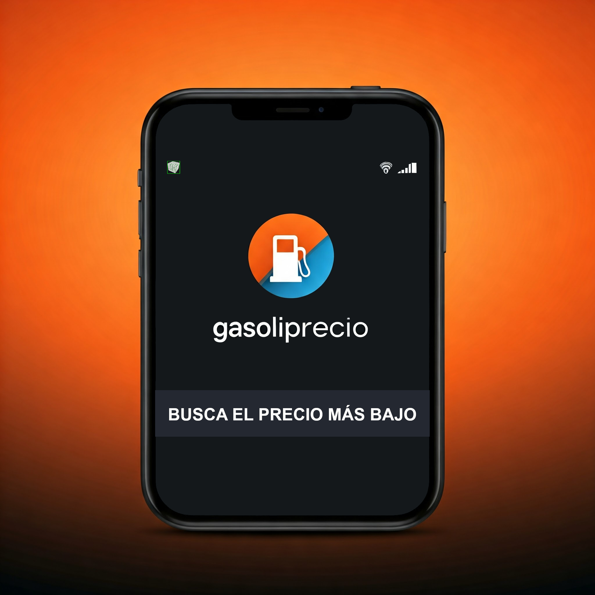

# Gasoliprecio App - Precios de Carburantes en España 🇪🇸

<div align="center">



**Aplicación Android para consultar precios actualizados de combustibles en España**

</div>

---

## 📱 Descripción

**Gasoliprecio** es una aplicación Android que permite consultar en tiempo real los precios de combustibles en todas las estaciones de servicio de España. Los datos se obtienen directamente de la API oficial del **Ministerio para la Transición Ecológica y el Reto Demográfico**. Por eso los precios son los que proporciona el ministerio.

## ✨ Características principales

### 📍 Listado organizado por provincias
- Gasolineras **agrupadas por provincias** con desplegables expandibles/colapsables
- Por defecto, todas las provincias están **colapsadas** para una vista general
- Haz clic en cualquier provincia para ver sus estaciones
- **Contador de estaciones** por provincia
- Icono visual (▶/▼) indica el estado del desplegable
- Provincias ordenadas alfabéticamente

### 🔍 Buscador avanzado
- Búsqueda en **tiempo real** mientras escribes
- **Busca por múltiples criterios**:
  - Comunidad Autónoma (ej: "Andalucía", "Madrid")
  - Provincia (ej: "Barcelona", "Valencia")
  - Nombre de la estación (ej: "Repsol", "Cepsa", "BP")
  - Localidad/Municipio
  - Dirección
  - Productos (ej: "Gasolina 95", "Gasóleo A")
  - Precios (ej: "1.5")
- Las provincias con resultados **se expanden automáticamente**
- Placeholder: "Buscar gasolinera"

### ⭐ Sistema de favoritos
- **Botón de favoritos** en la pantalla principal
- Marca/desmarca favoritos con la **estrella (⭐/☆)** de cada estación
- Favoritos **guardados permanentemente** (SharedPreferences)
- **Pantalla dedicada** para ver solo tus favoritas
- **Eliminar favoritos** fácilmente:
  - Clic en la estrella de la estación
  - Clic en el botón de basura (🗑️)
  - Diálogo de confirmación antes de eliminar
- Los favoritos se sincronizan en todas las pantallas

### 📊 Detalles completos de estaciones
Al hacer clic en cualquier gasolinera se muestra:
- Nombre completo
- Localidad y provincia
- Comunidad Autónoma
- **Dirección física** (clic para abrir en Google Maps)
- **Lista completa de productos y precios disponibles**

#### 🛢️ Productos soportados:

**Gasolinas:**
- Gasolina 95 E5
- Gasolina 98 E5
- Gasolina 95 E10
- Gasolina 98 E10
- Gasolina 95 E5 Premium

**Gasóleos:**
- Gasóleo A
- Gasóleo B
- Gasóleo Premium

**Biocarburantes:**
- Biodiesel
- Bioetanol

**Gases:**
- GLP (Gases Licuados del Petróleo)
- Gas Natural Comprimido
- Gas Natural Licuado

**Otros:**
- Hidrógeno

### ℹ️ Pantalla "Acerca de"
- Logo de la aplicación
- Información sobre Gasoliprecio
- Versión actual: **1.0**
- Enlace directo al repositorio de GitHub
- Descripción de funcionalidades

### 🎨 Diseño y UX
- **Logo personalizado** en:
  - Icono de la aplicación
  - Splash screen (3.5 segundos)
  - Barra de título
  - Pantalla "Acerca de"
- **Esquema de colores consistente**:
  - Azul cielo claro (#E3F2FD) para fondos
  - Azul oscuro (#1565C0) para textos y títulos
  - Barra de título personalizada con logo y título
- **Splash screen** al iniciar la aplicación (3.5 segundos)
- Interfaz intuitiva y moderna

## 🛠️ Tecnologías utilizadas

- **Kotlin** - Lenguaje de programación principal
- **Android SDK** - Framework de desarrollo
- **Coroutines** - Programación asíncrona
- **RecyclerView** - Listas eficientes y adaptables
- **SharedPreferences** - Almacenamiento local de favoritos
- **OkHttp** - Cliente HTTP para llamadas a la API
- **Gson** - Parseo de JSON
- **Material Components** - Diseño moderno
- **Google Maps** - Integración para navegación

## 📡 Fuente de datos

Los datos se obtienen en tiempo real de:
- **API Oficial**: Ministerio para la Transición Ecológica y el Reto Demográfico
- **URL**: https://sedeaplicaciones.minetur.gob.es/ServiciosRESTCarburantes/PreciosCarburantes/EstacionesTerrestres/

## 📦 Requisitos

- Android **7.0 (API 24)** o superior
- Conexión a Internet para descargar datos

## 🚀 Instalación

### Desde el código fuente:

1. Clona el repositorio:
```bash
git clone https://github.com/sapoclay/gasoliprecioapp.git
cd gasoliprecioapp
```

2. Abre el proyecto en Android Studio

3. Sincroniza las dependencias de Gradle

4. Compila y ejecuta:
```bash
./gradlew assembleDebug
```

5. Instala el APK en tu dispositivo:
```bash
adb install app/build/outputs/apk/debug/app-debug.apk
```

## 🎯 Uso

1. **Inicio**: La app muestra un splash screen y carga automáticamente los datos
2. **Explorar**: Navega por las provincias expandiendo los desplegables
3. **Buscar**: Usa el buscador para encontrar gasolineras específicas
4. **Ver detalles**: Haz clic en cualquier estación para ver precios completos
5. **Favoritos**: Marca tus estaciones favoritas con la estrella
6. **Google Maps**: Haz clic en la dirección para obtener indicaciones

## 📁 Estructura del Proyecto

```
app/
├── src/main/
│   ├── java/com/example/gasolina/
│   │   ├── MainActivity.kt           # Pantalla principal con listado
│   │   ├── SplashActivity.kt         # Splash screen inicial
│   │   ├── FavoritesActivity.kt      # Pantalla de favoritos
│   │   ├── AboutActivity.kt          # Pantalla "Acerca de"
│   │   ├── StationsAdapter.kt        # Adaptador RecyclerView
│   │   ├── Station.kt                # Modelo de datos
│   │   ├── StationsRepository.kt     # Repositorio en memoria
│   │   └── FavoritesManager.kt       # Gestión de favoritos
│   ├── res/
│   │   ├── layout/                   # Layouts XML
│   │   ├── drawable/                 # Recursos gráficos (logo)
│   │   ├── values/                   # Colores, strings, temas
│   │   └── mipmap/                   # Iconos de launcher
│   └── AndroidManifest.xml
└── build.gradle.kts
```

## 🤝 Contribuciones

Las contribuciones son bienvenidas. Por favor:

1. Fork el proyecto
2. Crea una rama para tu feature (`git checkout -b feature/AmazingFeature`)
3. Commit tus cambios (`git commit -m 'Add some AmazingFeature'`)
4. Push a la rama (`git push origin feature/AmazingFeature`)
5. Abre un Pull Request

## 📄 Licencia

Este proyecto es de código abierto y está disponible para uso educativo y personal.

## 👨‍💻 Autor

**Sapoclay**
- GitHub: [@sapoclay](https://github.com/sapoclay)
- Proyecto: [gasoliprecioapp](https://github.com/sapoclay/gasoliprecioapp)

## 🙏 Agradecimientos

- Ministerio para la Transición Ecológica y el Reto Demográfico por proporcionar la API pública
- Comunidad Android de código abierto

---

<div align="center">
**Desarrollado con ☕ en Kotlin por entreunosyceros.net**

</div>
